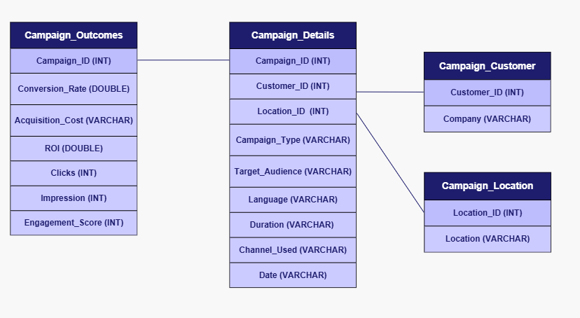
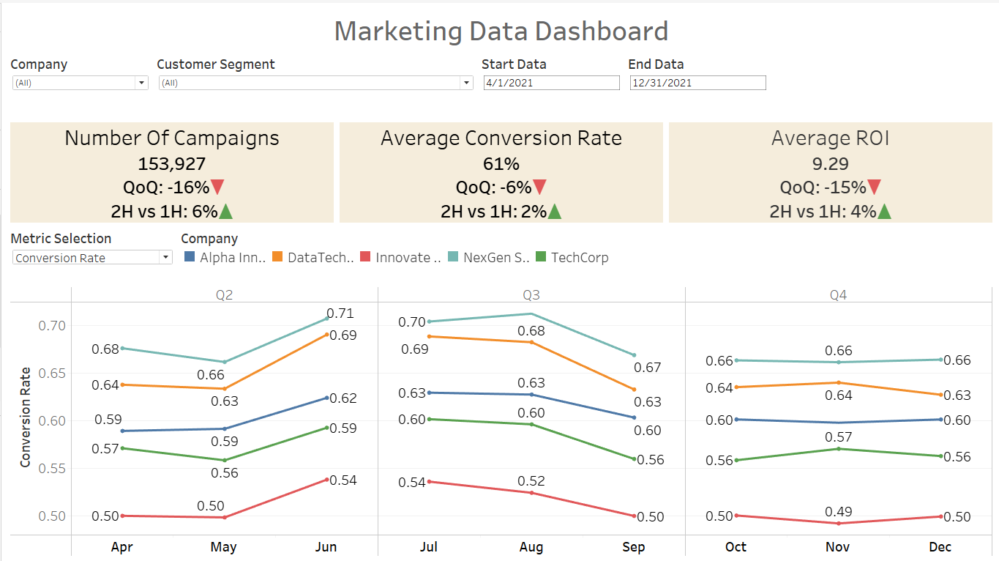

# Marketing-Analysis-Project

## Project Background 
Accel, established in 2020, is an independent "tech-focused" marketing firm offering services such as omnichannel execution, content marketing, digital experience, and branding.

As Q4 concludes, Accel is reviewing its four largest clients to identify successes and gaps across all 2025 marketing campaigns, aiming to inform future client engagements and refine upcoming campaign strategies.

Insights and recommendations are provided in these key areas:

**Campaign Performance Analysis**: Compare conversion rate, acquisition cost, ROI, engagement score, clicks, and impressions across different campaign types, channels, locations, languages, and customer segments.

**Customer Segmentation Analysis**: Analyze results by target audience and customer segment to discover which groups respond best to different campaign types or channel mixes.

**Engagement and Funnel Analysis**: Relate engagement_score to conversion and downstream metrics to see how user interaction correlates with business outcomes.

**Seasonality Analysis**: Identify and interpret recurring patterns in business outcomes that are linked to specific periods or cycles.

## Data Structure Overview

The data for this analysis is organized in a relational cloud database that is hosted by Accel. Details of a marketing campaign are divided into various tables in a star schema, all linked using a primary key. The tables are Campaign Customer, Campaign_ Details, Campaign Location, and Campaign Outcomes. See Table 1 for the fields in the different data tables. 

Manipulations, formatting, and data aggregations can be found in the detailed SQL code here.

## Executive Summary

Overall, significant changes are observed during the end of Q2 and beginning of Q3,the summer months, likely due to seasonality trends. In Q4, we observe drop off from the summer months as all key indicators fell, number of campaigns(-16%), Conversion Rate(-6%), and ROI(-15%). Key Arcoss campaigns for the first and the second half of the year, key indicators show higher number of campigns(+6%), and slight increase in Conversion Rate(+2%) and ROI(+4%). All in all, 2H of the year seems to outperform first half due to summer month boost. The following sections will highlight additional factors within the campaign dataset and dicsuss key opportunity areas for improvment. 

Below is the overview page from the Tableau Dashboard, visualizing the trends and key metrics from the marketing campaign analysis. The entire live dashboard can be viewed here: (placeholder)

Next, we will look at some tailored SQL queries or analysis for deeper dives. 

## Insights Deep-Dive

Metrics Table.png
First, campaign effectivenss varies between clients. Across key metrics, NextGen Systems has the most successful campaigns showing high Conversion Rate, ROI, and Engagement Rate. Conversely, acquistion cost is the highest for NexGen System likely due to . Additionally, we see slight summer seasonality boost as all key metrics for all clients increased over this period. After summer, we see Q4 Conversion Rate and ROI decrease for all across clients. 

