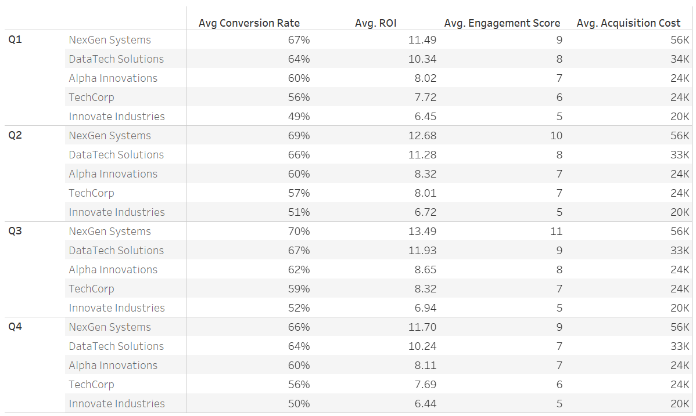

# Marketing-Analysis-Project

## Project Background 
Accel, established in 2020, is an independent "tech-focused" marketing firm offering services such as omnichannel execution, content marketing, digital experience, and branding.

As Q4 concludes, Accel is reviewing its four largest clients to identify successes and gaps across all 2025 marketing campaigns, aiming to inform future client engagements and refine upcoming campaign strategies.

Insights and recommendations are provided in these key areas:

**Campaign Performance Analysis**: Compare conversion rate, acquisition cost, ROI, engagement score, clicks, and impressions across different campaign types, channels, locations, languages, and customer segments.

**Customer Segmentation Analysis**: Analyze results by target audience and customer segment to discover which groups respond best to different campaign types or channel mixes.

**Engagement and Funnel Analysis**: Relate engagement_score to conversion and downstream metrics to see how user interaction correlates with business outcomes.

**Seasonality Analysis**: Identify and interpret recurring patterns in business outcomes that are linked to specific periods or cycles.

## Data Structure Overview

The data for this analysis is organized in a relational cloud database hosted by Accel. Details of a marketing campaign are divided into various tables in a star schema, all linked using a primary key. The tables are **Campaign Customer**, **Campaign Details**, **Campaign Location**, and **Campaign Outcomes**. See Table 1 for the fields in the different data tables.

Manipulations, formatting, and data aggregations can be found in the detailed SQL code here.

## Executive Summary

Overall, significant changes were observed during the end of Q2 and beginning of Q3—the summer months—likely due to seasonality trends. In Q4, we observed a drop-off from the summer months as all key indicators fell: number of campaigns (-16%), conversion rate (-6%), and ROI (-15%). Across campaigns for the first and second halves of the year, key indicators show a higher number of campaigns (+6%), and a slight increase in conversion rate (+2%) and ROI (+4%). All in all, the second half of the year seems to outperform the first half due to the summer month boost.  

Below is the overview page from the Tableau Dashboard, visualizing the trends and key metrics from the marketing campaign analysis. The entire live dashboard can be viewed here:[ (Live Dashboard)](https://public.tableau.com/views/MarketingProject_17623100950970/Dashboard1?:language=en-US&publish=yes&:sid=&:redirect=auth&:display_count=n&:origin=viz_share_link)

Next, we will look at some tailored SQL queries or analysis for deeper dives. 

## Insights Deep-Dive

 
First, campaign effectiveness varies between clients. Across key metrics, **NextGen Systems** has the most successful campaigns, showing high conversion rates, ROI, and engagement rates. Conversely, acquisition cost is the highest for NextGen Systems, likely due to marketing spend efficiency. Additionally, we see a slight summer seasonality boost, as all key metrics for all clients increased over this period. After summer, we see Q4 conversion rate and ROI decrease for all clients.

    
Next, we analyzed customer segments and the marketing channels used in campaigns over time. The stacked bar graph at the top illustrates that targeted campaigns for **Outdoor Enthusiasts** and **Foodies** peaked during the summer months, reflecting a strategic focus on engaging these segments when they are most active and responsive. The bottom stacked chart reveals these groups are most effectively reached through **Email**, **Google Ads**, and **Website** channels, as evidenced by the corresponding spikes in campaign activity in those mediums during the same period. This approach highlights the importance of segment-targeted channel selection and timing in maximizing engagement and marketing impact.

## Recommendation 

**Seasonal Promotion**: As seasonality is observed in the marketing campaign data, summer months need to be prioritized—especially for **Foodies** and **Outdoor Enthusiasts**. Consider launching seasonally themed campaigns ahead of peak seasons to prime targeted customers for increased engagement leading to higher conversion. For example, introduce seasonal messaging like *“products to aid summer travels or adventures”* to further seasonal engagement. Potential gaps remain as the number of campaigns and penetration into customer segments like **Fashionistas**, **Health & Wellness**, and **Tech** remain stagnant. These customer segments represent business opportunities and valuable audiences to engage, especially for tech-focused clients.

**Channel Optimization and Diversification**: Email, Google Ads, and Website are popular marketing channels for **Foodies** and **Tech Enthusiasts**. Marketing campaign channels need to be tailored to the customer to drive higher engagement and conversion rates. In addition, further research is required to understand the preferred marketing channels to reach other customer segments and expand campaign presence. Lastly, consider new forms of channels, as the way specific customers consume media is evolving. Partnerships with content creators or usage of TikTok and short-form videos like Reels across social media platforms can be beneficial to marketing channel optimization.

**Revisit NextGen Systems Campaigns**: It is beneficial to revisit the marketing campaigns of **NextGen Systems**, as their projects consistently outperform those of other companies in this analysis across engagement, conversion, and ROI. Although acquisition cost is much higher (at least 50%), it's critical to understand if there were unique marketing elements that influenced these exceptional results.

